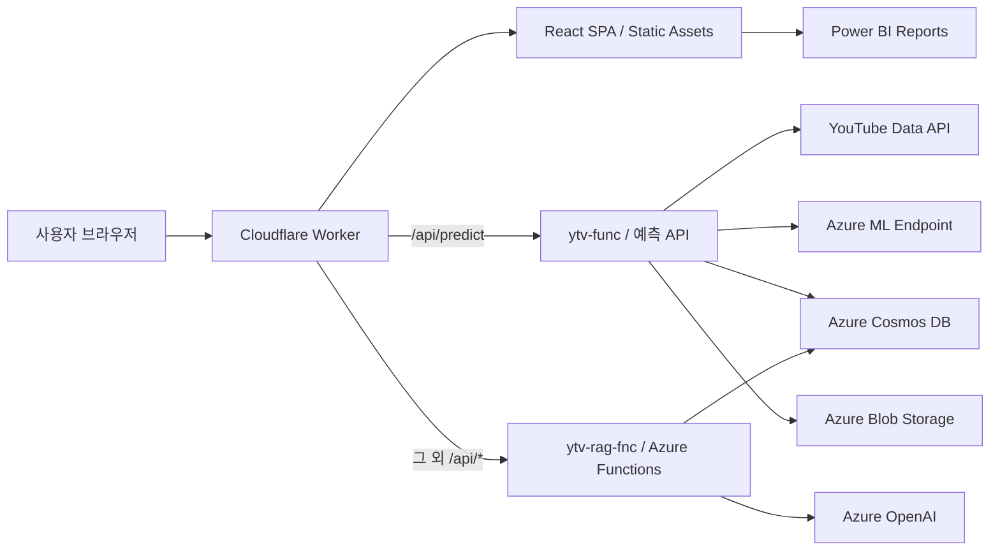

<p align="center">
  
</p>

<h1 align="center">유바씨 — YouTube Viral Signal</h1>

<p align="center">
  감이 아닌 데이터로 채널과 영상의 가능성을 확인하는<br />
  YouTube 바이럴 분석·예측 및 크리에이터 인사이트 서비스
</p>

<p align="center">
  <a href="https://youtube-viral-web.heyyouman86.workers.dev">서비스 바로가기</a>
</p>

---

## 프로젝트 소개

유바씨는 YouTube 영상의 초기 정보, 채널 특성, 썸네일 특징과 운영 데이터를 활용해 영상의 **상대적인 바이럴 성과를 0~100점으로 표현**하고, 채널별 성과 비교와 데이터 기반 질의응답을 제공하는 웹 서비스입니다.

구독자 수가 크게 다른 채널을 단순 조회수만으로 비교하면 대형 채널에 유리합니다. 이 프로젝트는 각 채널의 평소 성과와 영상의 초기 신호를 함께 고려하여 다음 문제를 해결하고자 했습니다.

- 채널 규모가 다른 영상의 성과를 동일한 기준으로 비교하기 어려운 문제
- 영상 게시 초기에 향후 성과 가능성을 판단하기 어려운 문제
- 수집·예측·성과 추적·라벨 생성 과정이 여러 Azure 자원에 분산된 문제
- 운영 데이터를 사용자가 이해하기 쉬운 리포트와 대화형 답변으로 전달하기 어려운 문제

> **바이럴 스코어는 데이터 기반 참고 지표입니다. 실제 조회수나 성과와 차이가 있을 수 있으며, 특정 성과를 보장하지 않습니다.**

| 구분 | 내용 |
| --- | --- |
| 프로젝트 유형 | 1팀 1차 팀 프로젝트 |
| 개발 기간 | 2026.07 ~ 2026.08 |
| 분석 대상 | 한국어 먹방·게임 일반 영상 (`KR_MUKBANG`, `KR_GAMING`) |
| 프론트엔드 | React 19, Vite 8, React Router, JavaScript, CSS |
| API 게이트웨이·배포 | Cloudflare Workers, Wrangler |
| 애플리케이션 백엔드 | Python 3.11, Azure Functions |
| 데이터·AI | Azure Cosmos DB, Azure OpenAI, Azure Machine Learning, Power BI |

## 주요 기능

### 1. 최근 영상 랭킹

- 최근 7일 내 수집된 영상의 바이럴 스코어를 기준으로 순위 제공
- 전체 검색 결과에서 점수가 높은 영상 TOP 10 표시
- 영상 제목, 카테고리, 채널, 구독자 수, 바이럴 스코어 제공
- 채널명·영상명·카테고리 통합 검색

### 2. 채널 리포트

- 로그인 계정에 연결된 YouTube 채널 요약
- 구독자 수, 누적 조회수, 채널 평균 바이럴 스코어 제공
- 같은 카테고리의 채널을 구독자 규모별로 비교
- 평균 바이럴 스코어가 높은 카테고리 TOP 3 채널과 대표 영상 제공
- 채널 목록이 많아져도 가로 캐러셀로 탐색할 수 있는 구조

### 3. 영상 인사이트

- 조회수와 참여율을 축으로 영상 성과 분포 시각화
- 각 영상을 점으로 표시하고 선택한 영상의 상세 정보 제공
- 좋아요·댓글·조회수 기반 참여 신호와 개별 영상 성과 비교

### 4. 바이럴 스코어

- 공개 YouTube 영상 URL과 카테고리를 입력해 예측 요청
- 영상 제목·썸네일·카테고리·예측 점수 표시
- 반원형 게이지와 5단계 등급으로 결과 시각화

| 점수 | 단계 |
| ---: | --- |
| 0~19 | 매우 낮음 |
| 20~39 | 낮음 |
| 40~59 | 보통 |
| 60~79 | 높음 |
| 80~100 | 매우 높음 |

예측 요청은 Cloudflare Worker가 별도 운영 중인 `ytv-func`의 URL 예측 API로 전달합니다. 이 저장소에는 예측 모델과 수집 파이프라인 자체가 포함되지 않으며, 프론트엔드와 해당 서비스의 연동 코드가 포함되어 있습니다.

### 5. 데이터 기반 AI 챗봇

- 로그인 사용자의 연결 채널 범위 안에서만 운영 데이터 조회
- 채널 성장, 영상 성과, 예측 점수, 실제 성과 비교, 랭킹 등 질문 분류
- Cosmos DB의 실제 조회 결과와 계산 근거를 Azure OpenAI에 전달
- 현재 화면에서 선택한 영상을 후속 질문의 문맥으로 연결
- 데이터가 부족한 경우 값을 임의로 만들지 않고 조회 가능 여부를 구분

### 6. 관리자 대시보드

관리자 계정에만 통합 Power BI 관리자 페이지를 노출합니다. 보고서는 웹 애플리케이션 내부 `iframe`에 삽입됩니다.

### 7. 계정 및 화면 설정

- 회원가입·로그인과 JWT 기반 사용자 인증
- 가입 계정과 YouTube 채널 연결
- 라이트·다크 테마 전환
- 관리자 권한에 따른 메뉴·페이지 접근 제어

## 전체 아키텍처



### 요청 흐름

1. Vite가 React 애플리케이션을 빌드합니다.
2. Cloudflare Worker가 정적 파일과 SPA 라우팅을 처리합니다.
3. `/api/predict` 요청에는 Cloudflare가 예측 Function Key를 추가해 `ytv-func`로 전달합니다.
4. 나머지 `/api/*` 요청에는 RAG Function Key를 추가해 `ytv-rag-fnc`로 전달합니다.
5. 브라우저에는 Azure Function Key와 백엔드 연결 문자열을 노출하지 않습니다.
6. 사용자 API는 Function Key 외에도 로그인 후 발급받은 Bearer 토큰으로 권한을 검사합니다.

## 운영 데이터 파이프라인

예측·수집용 `ytv-func`는 별도 배포 서비스이며, 전체 서비스에서는 다음 순서로 운영됩니다.


- 매시 00분·30분: 관리 채널의 신규 영상 수집 및 예측
- 매시 10분·40분: 영상·채널 Snapshot 수집 및 라벨링
- `channels`, `videos`: 채널·영상 기준 정보
- `channel_snapshots`, `video_snapshots`: 시점별 변화 데이터
- `predictions`: 모델 예측 결과
- `labels`: 실제 관측 성과를 반영한 평가 라벨

## 저장소 구성

```text
.
├─ youtube-viral-web/          # React + Cloudflare Workers 프론트엔드
│  ├─ src/
│  │  ├─ api/                  # 브라우저 API 클라이언트
│  │  ├─ assets/               # 로고와 화면 이미지
│  │  ├─ components/           # 공통 UI, 인증 가드, 사이드바, 게이지
│  │  ├─ context/              # 현재 선택 영상 문맥
│  │  ├─ pages/                # 서비스 페이지
│  │  └─ utils/                # 카테고리·숫자 표시 유틸리티
│  ├─ worker/index.js          # API 프록시 및 Function Key 주입
│  ├─ package.json
│  ├─ vite.config.js
│  └─ wrangler.jsonc
│
├─ ytv-rag-fnc/                # 인증·대시보드·RAG Azure Functions
│  ├─ shared/
│  │  ├─ auth_service.py       # 사용자 인증과 토큰 처리
│  │  ├─ cosmos_repository.py  # Cosmos DB 조회 계층
│  │  ├─ dashboard_service.py  # 화면용 데이터 조합
│  │  ├─ data_adapter.py       # 문서 스키마 정규화
│  │  ├─ metrics.py            # 파생 지표 계산
│  │  ├─ rag_service.py        # 질문 분석·조회·답변 오케스트레이션
│  │  └─ openai_service.py     # Azure OpenAI 채팅·임베딩
│  ├─ tests/                   # 백엔드 단위 테스트
│  ├─ function_app.py          # Azure Functions 진입점
│  ├─ host.json
│  └─ requirements.txt
│
└─ README.md
```

## 페이지 구성

| 경로 | 접근 권한 | 설명 |
| --- | --- | --- |
| `/` | 공개 | 서비스 소개와 기능·요금제 안내 |
| `/login` | 공개 | 로그인 |
| `/register` | 공개 | 회원가입 및 YouTube 채널 연결 |
| `/home` | 로그인 | 최근 7일 영상 랭킹 |
| `/my-channel` | 로그인 | 채널 리포트와 동급 채널 비교 |
| `/predict` | 로그인 | URL 기반 바이럴 스코어 예측 |
| `/lab/video-insights` | 로그인 | 영상별 조회수·참여율 인사이트 |
| `/settings` | 로그인 | 계정·연결 채널·테마 관리 |
| `/admin` | 관리자 | 통합 Power BI 관리자 대시보드 |

## API

### Cloudflare 프록시

| 브라우저 요청 | 전달 대상 | 설명 |
| --- | --- | --- |
| `/api/predict` | `PREDICT_FUNCTION_BASE_URL` | URL 단건 바이럴 예측 |
| `/api/*` | `AZURE_FUNCTION_BASE_URL` | 인증·대시보드·RAG API |

Cloudflare Worker는 서버 측 Secret으로 관리되는 `x-functions-key`를 업스트림 요청에 추가합니다.

### `ytv-rag-fnc` 엔드포인트

| Method | Route | 로그인 토큰 | 설명 |
| --- | --- | :---: | --- |
| `GET` | `/api/health` | - | 서비스 설정 및 연결 상태 확인 |
| `POST` | `/api/auth/register` | - | 사용자·연결 채널 등록 |
| `POST` | `/api/auth/login` | - | 로그인 및 Access Token 발급 |
| `GET` | `/api/auth/me` | 필요 | 현재 사용자 조회 |
| `GET` | `/api/channel/summary` | 필요 | 사용자 채널 요약·비교 데이터 조회 |
| `GET` | `/api/channel/videos` | 필요 | 사용자 채널 영상 목록 조회 |
| `GET` | `/api/video/metadata` | 필요 | 선택 영상 메타데이터 조회 |
| `GET` | `/api/dashboard/admin-overview` | 관리자 | 전체 랭킹·관리자 요약 데이터 조회 |
| `POST` | `/api/chat` | 필요 | 채널 범위 기반 RAG 답변 생성 |
| `POST` | `/api/rag/index` | Function Key | 내장 지식 문서 임베딩·색인 |

Azure Functions 자체는 Function 인증 수준을 사용합니다. 로그인 토큰이 필요하지 않은 API도 직접 호출하려면 올바른 Function Key가 필요합니다.

## RAG 처리 방식

```text
사용자 질문
  → JWT 및 연결 채널 권한 확인
  → 질문 유형·영상·기간·지표 분석
  → 필요한 Cosmos DB 컨테이너만 조회
  → 저장 지표 우선 사용, 필요한 값만 Python으로 계산
  → 관련 지식 문서 임베딩 검색
  → 조회 데이터와 계산 근거를 Azure OpenAI에 전달
  → 답변과 사용 근거 반환
```

- 다른 일반 사용자의 채널 데이터는 질문에 포함되어도 조회 전에 차단합니다.
- 관리자만 전체 채널 범위의 운영 데이터를 조회할 수 있습니다.
- 저장된 값이 있으면 이를 우선 사용하고, 원본 값이 충분한 경우에만 파생 지표를 계산합니다.
- 계산할 수 없는 값은 임의의 0으로 만들지 않고 `null` 또는 사용 불가 상태로 처리합니다.
- 임베딩 검색 실패 시 어휘 기반 검색으로 대체합니다.

## 기술 스택

| 영역 | 기술 |
| --- | --- |
| Frontend | React 19, React Router 7, Vite 8, JavaScript, CSS |
| Edge / Hosting | Cloudflare Workers, Static Assets, Wrangler |
| Backend | Python 3.11, Azure Functions v4 |
| Database | Azure Cosmos DB |
| AI / RAG | Azure OpenAI Chat, Embeddings, Structured Outputs |
| Prediction | Azure Machine Learning Endpoint, 외부 `ytv-func` |
| Visualization | 자체 React 시각화, Power BI |
| Authentication | JWT, 채널 범위 권한 검사 |
| Monitoring | Application Insights, Power BI 운영 보고서 |
| Test / Quality | ESLint, Vite Build, Pytest |

## 로컬 실행

### 사전 요구 사항

- Node.js 20 이상
- npm
- Python 3.11
- Azure Functions Core Tools v4
- 접근 권한이 승인된 Azure 개발 리소스

### 프론트엔드

```powershell
cd youtube-viral-web
npm install
npm run dev
```

기본 개발 서버는 Vite가 안내하는 로컬 주소에서 실행됩니다. 브라우저의 `/api/*` 요청까지 테스트하려면 Wrangler를 사용합니다.

```powershell
Copy-Item .dev.vars.example .dev.vars
npx wrangler dev
```

`.dev.vars`에는 실제 Function Key가 포함될 수 있으므로 Git에 커밋하지 않습니다.

### RAG Azure Functions

```powershell
cd ytv-rag-fnc
py -3.11 -m venv .venv
.\.venv\Scripts\Activate.ps1
python -m pip install --upgrade pip
python -m pip install -r requirements.txt
func start
```

로컬 환경 변수에는 승인받은 개발용 값만 사용하며 `.env.local`, `local.settings.json`과 실제 인증 정보는 커밋하지 않습니다.

## 환경 변수

### Cloudflare Worker 런타임

| 변수 | 유형 | 설명 |
| --- | --- | --- |
| `AZURE_FUNCTION_BASE_URL` | Variable | `ytv-rag-fnc` API 기본 주소 |
| `PREDICT_FUNCTION_BASE_URL` | Variable | `ytv-func` URL 예측 API 주소 |
| `AZURE_FUNCTION_KEY` | Secret | RAG Function Key |
| `PREDICT_FUNCTION_KEY` | Secret | 예측 Function Key |
| `VITE_POWER_BI_ADMIN_OVERVIEW_URL` | Variable | 통합 관리자 보고서 URL. 직접 Wrangler 배포에서도 사용 |

### 프론트엔드 빌드

| 변수 | 설명 |
| --- | --- |
| `VITE_POWER_BI_ADMIN_OVERVIEW_URL` | 통합 관리자 보고서 URL |

`VITE_` 변수는 클라이언트 번들에 포함되므로 비밀키를 저장하면 안 됩니다.

### `ytv-rag-fnc`

| 변수 | 설명 |
| --- | --- |
| `AZURE_OPENAI_ENDPOINT` | Azure OpenAI Endpoint |
| `AZURE_OPENAI_API_KEY` | 로컬 개발용 API Key, Azure에서는 Managed Identity 권장 |
| `AZURE_OPENAI_CHAT_DEPLOYMENT` | 답변 생성 배포 이름 |
| `AZURE_OPENAI_EMBEDDING_DEPLOYMENT` | 임베딩 배포 이름 |
| `COSMOS_DB_ENDPOINT` | 운영 Cosmos DB Endpoint |
| `COSMOS_DB_CONNECTION_STRING` | 로컬 대체 연결 방식, Azure에서는 Managed Identity 권장 |
| `COSMOS_DB_DATABASE` | 채널 운영 데이터베이스 |
| `COSMOS_APP_DB_DATABASE` | 사용자·RAG 데이터베이스 |
| `JWT_SECRET` | Access Token 서명 Secret |
| `AUTH_TOKEN_TTL_HOURS` | 토큰 만료 시간, 기본 24시간 |

컨테이너 이름은 환경 변수로 변경할 수 있으며 기본값은 `channels`, `videos`, `video_snapshots`, `channel_snapshots`, `predictions`, `labels`, `users`, `rag_documents`입니다.

## 테스트 및 검증

### 프론트엔드

```powershell
cd youtube-viral-web
npm run lint
npm run build
```

### 백엔드

```powershell
cd ytv-rag-fnc
python -m pip install pytest
python -m pytest -q
```

현재 저장소 기준 검증 결과:

- 프론트엔드 ESLint 통과
- 프론트엔드 Vite 프로덕션 빌드 통과
- 백엔드 `124 passed, 18 subtests passed`

## 배포

### Cloudflare Workers

Cloudflare Git 연동 프로젝트의 Root directory는 모노레포 내 프론트엔드 폴더로 설정합니다.

```text
Root directory: youtube-viral-web
Build command: npm run build
Deploy command: npx wrangler deploy
Production branch: main
```

또는 로컬에서 다음 명령으로 배포할 수 있습니다.

```powershell
cd youtube-viral-web
npm run build
npx wrangler deploy
```

### Azure Functions

Azure 설정과 권한을 먼저 확인한 후 RAG Function을 배포합니다.

```powershell
cd ytv-rag-fnc
func azure functionapp publish <FUNCTION_APP_NAME> --python
```

Function Key, Cosmos DB 자격 증명, JWT Secret, Azure OpenAI Key는 저장소가 아니라 Cloudflare Secrets 또는 Azure Function App Settings에서 관리합니다.

## 보안 설계

- 브라우저에 Azure Function Key를 전달하지 않고 Cloudflare Worker에서 주입
- 비밀번호를 원문으로 저장하지 않고 Salt 기반 해시로 저장
- JWT로 로그인 상태를 확인하고 사용자·관리자 권한 분리
- 일반 사용자의 데이터 조회 범위를 연결된 `channel_id`로 제한
- Azure 환경에서는 `DefaultAzureCredential`과 Managed Identity 사용 가능
- `.env.local`, `.dev.vars`, `local.settings.json`, 가상환경 및 빌드 결과는 Git에서 제외
- 내부 DB 필드명과 원본 서버 오류를 사용자 화면에 직접 노출하지 않도록 메시지 변환

## 팀 역할

| Part | 담당 | 주요 업무 |
| --- | --- | --- |
| 데이터 수집 | 최형찬 | YouTube Data API 기반 채널·영상·Snapshot 수집 |
| 데이터 전처리 | 김지수 | 데이터 정제, Feature Engineering, 학습 데이터 구성 |
| Machine Learning | 박준용 | 모델 학습·평가, Azure ML 추론 및 라벨링 패키지 |
| 온라인 파이프라인 | 신민철 | Azure Functions, Cosmos DB, Blob Storage, 예약 파이프라인 통합 |
| 시각화·서비스 | 민찬기 | React 웹, Power BI, RAG 연동, 화면 설계 및 통합 QA |

## 현재 범위와 한계

- 운영 예측 카테고리는 현재 먹방과 게임입니다.
- 바이럴 스코어는 모델의 상대 성과 추정값이며 조회수나 성공 확률을 보장하지 않습니다.
- 비공개·삭제·연령 제한 영상이나 YouTube 메타데이터 제공 조건에 따라 제목·썸네일을 가져오지 못할 수 있습니다.
- Power BI 보고서의 갱신 주기는 Power BI 라이선스와 데이터 원본 새로 고침 설정의 영향을 받습니다.
- 외부 예측 파이프라인인 `ytv-func`와 ML 모델 소스는 이 저장소의 범위에 포함되지 않습니다.

---

<p align="center">
  <strong>감이 아닌 데이터로, 채널과 영상 분석을 통한 가능성을 확인하세요.</strong>
</p>
